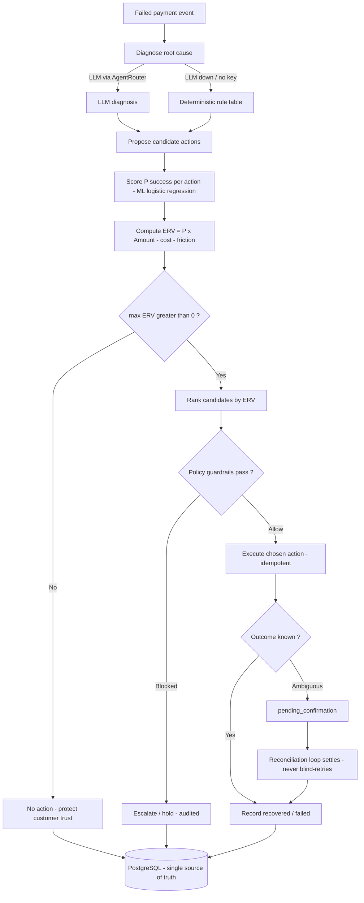
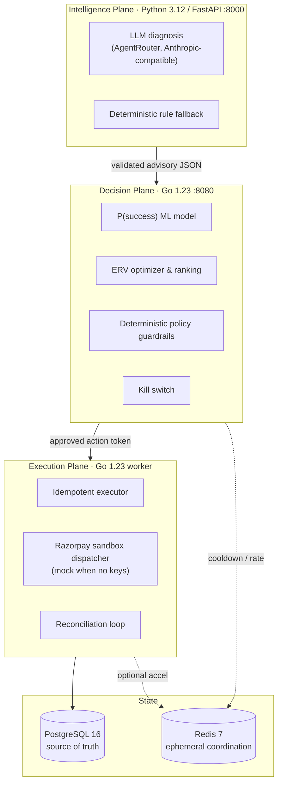

<p align="center">
  
</p>

<div align="center">

# Revly — Autonomous Revenue Recovery Decision Platform

**Razorpay AI Buildathon · Track 03 — Autonomous Revenue Recovery**

<a href="https://skillicons.dev">
  
</a>

</div>

Revly turns failed payments into recovered revenue — safely. It ingests failed-payment events,
diagnoses the root cause, computes the **Expected Recovery Value (ERV)** of each possible
intervention, and executes the best one **only when the economics are positive** and a deterministic
policy layer approves it. Every financial action is bounded, idempotent, and recorded in a single
PostgreSQL source of truth.

The design principle is a strict, non-bypassable pipeline:

> **LLM proposes → ML scores P(success) → ERV ranks → Policy approves → Executor acts → Postgres records.**
>
> No layer skips the one after it. The LLM is strictly advisory: it suggests candidate strategies
> but never computes probabilities, never selects the executed action, and never touches payment
> credentials.

---

## Why it exists

Merchants lose a meaningful share of gross revenue to failed payments — false-positive declines,
transient bank/gateway downtime, mandate expiry, and salary-cycle liquidity gaps. The default
industry response is **blind exponential retries**, which spam customers, exhaust gateway limits,
and drive abandonment.

Revly replaces blind retries with economic decisions:

- **Root-cause diagnosis** — separates a transient issuer decline from permanent card expiry from a
  liquidity gap, so the response fits the failure.
- **Economic optimization (ERV)** — intervenes only when expected recovery exceeds fees and customer
  friction; otherwise it stops.
- **Multi-channel fallbacks** — retry, delayed retry, alternate method, payment link, notify,
  escalate, or no-action.
- **Guaranteed idempotency** — atomic Postgres constraints plus optional Redis coordination make
  double-charges structurally impossible.

---

## Expected Recovery Value (ERV)

Revly optimizes **net merchant value**, not retry volume. For each candidate action *a*:

$$\text{ERV}(a) = \big( P(\text{success} \mid \mathbf{x}, a) \times \text{Amount} \big) - C_{\text{direct}}(a) - C_{\text{friction}}(a)$$

- **P(success | x, a)** — calibrated probability from the L2 logistic-regression model (with a
  heuristic fallback when no artifact is loaded).
- **Amount** — gross value at risk.
- **C_direct(a)** — gateway fees, SMS/WhatsApp notification cost.
- **C_friction(a)** — customer-relationship cost (fatigue, opt-out risk).
- **Stop rule** — if `max_a ERV(a) ≤ 0`, Revly takes no action and ends the recovery lifecycle to
  protect customer trust.

---

## The agent in action

> The figures below are **illustrative demo output**, not production results.

```
┌──────────────────────────────────────────────────────┐
│ REVENUE RECOVERY AGENT                    ● ACTIVE    │
│                                                      │
│  47 events analyzed       31 actions taken           │
│  ₹3.84L at risk           ₹2.17L recovered            │
│  18 actions prevented     12 stopped by economics    │
└──────────────────────────────────────────────────────┘
```

A single event moving through the pipeline:

```
AGENT ACTIVITY

10:42:31  Payment ₹8,499 failed
          ↓
10:42:32  Diagnosed: temporary issuer decline
          ↓
10:42:32  Evaluated 4 interventions
          ↓
10:42:32  Retry selected — ERV ₹7,561
          ↓
11:12:03  Retry succeeded
          ↓
11:12:03  ₹8,499 recovered
```

---

## How the agent decides



Policy guardrails are **deterministic and non-bypassable**: max retries, cooldown windows, minimum
ERV threshold, daily action cap, amount ceiling, confidence floor, fraud hard-stop, and a
merchant/global **kill switch**.

---

## System architecture

Three isolated planes, each degrading safely if the one above it is unavailable.



**Failure tolerance**

- **Intelligence plane down** — the Decision plane uses deterministic rule-based diagnosis; zero
  downtime.
- **Redis down** — cooldown/rate checks fall back to Postgres timestamps; financial correctness is
  never affected.
- **No Razorpay keys** — a deterministic mock executor runs; no money moves, the pipeline is fully
  exercisable.
- **Single source of truth** — Postgres holds immutable state transitions, the ledger, and
  idempotency locks.

Deeper detail: [`docs/ARCHITECTURE.md`](./docs/ARCHITECTURE.md) and
[`docs/ARCHITECTURE_DIAGRAM.md`](./docs/ARCHITECTURE_DIAGRAM.md).

---

## Tech stack

| Layer | Technology |
|---|---|
| Decision & execution engine | Go 1.23 (`net/http`, standard library routing) |
| Intelligence / diagnosis | Python 3.12, FastAPI, Pydantic |
| LLM inference | AgentRouter gateway (Anthropic-compatible), default `claude-sonnet-5` — **optional** |
| P(success) model | L2 logistic regression (NumPy), heuristic fallback |
| Data | PostgreSQL 16 (durable) · Redis 7 (ephemeral, optional) |
| Merchant dashboard & landing page | Next.js 14, React 18, TypeScript, Tailwind CSS |
| Payments | Razorpay API (sandbox); deterministic mock when unconfigured |
| Ops | Docker Compose, Prometheus, Grafana |

---

## Repository structure

```text
.
├── assets/                 Brand and banner assets
├── decision-engine/        Go 1.23 — Decision + Execution planes (:8080)
│   ├── cmd/server/         HTTP entrypoint
│   └── internal/           ingest · diagnosis · successmodel · erv · policy
│                           · executor · reconcile · api · store · cache · metrics
├── diagnosis-service/      Python 3.12 / FastAPI — Intelligence plane (:8000)
│   ├── main.py             /internal/diagnose classifier
│   └── llm_client.py       AgentRouter (Anthropic-compatible) client
├── ml/                     P(success) model training + artifacts
├── dashboard/              Next.js 14 merchant cockpit (:3000)
├── frontend/landing-page/  Next.js 14 marketing/landing page (:3001)
├── migrations/             PostgreSQL DDL (001–004)
├── schemas/                Cross-service JSON data contracts
├── scripts/                Seed + demo/chaos drivers, health check
├── sim/                    Held-out simulation harness + results
├── grafana/ · prometheus/  Telemetry provisioning
├── docs/                   API_CONTRACTS · RUNNING · ARCHITECTURE · hardening notes
├── PS and Solution/        Buildathon problem statement + plan
├── docker-compose.yml      Full multi-service stack
└── Makefile                Build, run, and test automation
```

---

## Documentation

| Document | What it covers |
|---|---|
| [`docs/API_CONTRACTS.md`](./docs/API_CONTRACTS.md) | Every implemented HTTP route — request/response schemas, auth, idempotency, examples. Start here for frontend integration. |
| [`docs/RUNNING.md`](./docs/RUNNING.md) | Full local run/verify guide — env vars, migrations, health/readiness, reset, troubleshooting. |
| [`docs/ARCHITECTURE.md`](./docs/ARCHITECTURE.md) | Technical specification of the three planes. |
| [`docs/production_hardening_notes.md`](./docs/production_hardening_notes.md) | Production-readiness gaps and plan. |

---

## Getting started

### Prerequisites

- Docker & Docker Compose (v24+) — the one-command path
- For bare-metal runs: Go 1.23+, PostgreSQL 16 + `psql`, Python 3.12+, Node.js 20+ & npm
- Redis 7 is **optional** (accelerator only)
- **No LLM key is required.** See [Do I need API keys?](#do-i-need-api-keys) below.

### Option 1 — Full stack with Docker Compose (recommended)

```bash
# 1. Create your env file (defaults work out of the box; no secrets required)
cp .env.example .env

# 2. Build and start every service
docker compose up -d --build

# 3. Verify health across services
make health
```

Migrations `001`–`004` and `scripts/seed_dev.sql` are auto-applied on a **fresh** Postgres volume.
To re-apply after editing them: `docker compose down -v && docker compose up -d --build`.

**Service URLs**

| Service | URL |
|---|---|
| Merchant dashboard | http://localhost:3000 |
| Decision engine (API) | http://localhost:8080 |
| Diagnosis service (internal) | http://localhost:8000 |
| Prometheus | http://localhost:9090 |
| Grafana | http://localhost:3001 |
| PostgreSQL | `localhost:5432` (user `revrec`, db `revrecovery`) |
| Redis | `localhost:6379` |

### Option 2 — Local development without Docker

```bash
# Start only the datastores in Docker
docker compose up -d postgres redis

# Apply migrations and seed data
make db-migrate
make db-seed

# Terminal 1 — Go decision engine (:8080)
make go-run

# Terminal 2 — Python diagnosis service (:8000)
make py-setup
make py-run

# Terminal 3 — Merchant dashboard (:3000)
make web-setup
make web-dev
```

### Option 3 — Landing page only

```bash
cd frontend/landing-page
npm install
npm run dev        # http://localhost:3001
```

> Note: the landing-page dev server and Grafana both default to port `3001`. Run one at a time, or
> start the landing page on another port (`npm run dev -- -p 3002`).

Full env-var reference and troubleshooting: [`docs/RUNNING.md`](./docs/RUNNING.md).

---

## Do I need API keys?

**No key is required to run Revly end-to-end.** Every external dependency has a safe fallback.

| Credential | If unset (default) | Set it when you want… |
|---|---|---|
| `ANTHROPIC_AUTH_TOKEN` (AgentRouter, Anthropic-compatible) | Diagnosis returns `503`; the Go engine uses its **deterministic rule-based diagnosis**. Pipeline runs normally. | LLM-generated root-cause diagnosis in the demo. Set the token and `ANTHROPIC_BASE_URL`. |
| `RAZORPAY_KEY_ID` / `RAZORPAY_KEY_SECRET` | A **deterministic mock executor** runs — no money moves. | Real Razorpay **sandbox** execution. |
| `API_KEY` / `ADMIN_API_KEY` | Auth is disabled (dev convenience; logged at startup). | Merchant/admin auth enforced. |
| `WEBHOOK_SECRET` | Inbound webhook signature verification disabled (dev). | HMAC-verified webhooks. |

You do **not** need Gemini or OpenRouter — Revly does not use them. LLM inference (if you enable it)
goes through **AgentRouter**, an Anthropic-compatible gateway, defaulting to `claude-sonnet-5`. The
diagnosis service is the only component that ever receives an LLM key, and it holds no payment
credentials.

---

## Verifying it works

Drive one event through the pipeline and read the decision back:

```bash
BASE=http://localhost:8080; M=merch_aggressive
curl -s -X POST $BASE/v1/merchants/$M/events/payment-failed -H 'Content-Type: application/json' \
  -d '{"schema_version":"0.1.0","external_event_id":"evt_readme_1","merchant_id":"'$M'","payment_id":"pay_readme_1","customer_id":"c1","event_type":"payment.failed","amount":250000,"currency":"INR","method":"card","failure_reason":"Issuer declined","prior_attempts":0,"occurred_at":"2026-09-05T10:00:00Z"}'

curl -s $BASE/v1/merchants/$M/payments/pay_readme_1/decisions | jq
curl -s $BASE/v1/merchants/$M/metrics/recovery-summary | jq
```

Demo and chaos drivers:

```bash
./scripts/seed_demo_data.sh    # seed + drive a batch of events
./scripts/chaos_demo.sh        # fraud hard-stop, kill switch, AI-down, Redis-down
python3 sim/run_simulation.py  # held-out simulation harness
```

Test suites:

```bash
make go-test            # Go unit tests + vet
make test-integration   # Go DB integration tests (idempotency, rollback, concurrency)
```

---

## Evaluation

Held-out simulation over **4,000 failed payments** generated with a different RNG seed than the
training set (never used in training or model selection). Four recovery strategies compared:

| Strategy | Recovery rate | Net recovered (₹) | Unnecessary interventions |
|---|:---:|---:|:---:|
| `no_action` (floor) | 0.0% | 0 | 0 |
| `always_retry` (blind) | 16.4% | 24,16,000 | 3,344 |
| `rule_based` | 38.1% | 57,52,667 | 2,476 |
| **`erv_based` (Revly)** | 34.6% | **52,69,451** | **2,274** |

The ERV strategy avoids economically pointless interventions — it spends the **least** on
intervention cost while recovering competitively and respecting every safety constraint (fraud →
escalate, confidence floor, retry limits). The P(success) model is a calibrated logistic regression
(holdout AUC ≈ 0.68, Brier ≈ 0.21).

> **These are simulated results on synthetic data with documented assumptions
> (`ml/README_data_assumptions.md`). They do not represent real Razorpay customer behavior.**
> Reproduce with `python3 sim/run_simulation.py`; raw output in [`sim/results/`](./sim/results/).

---

## Observability

- **Health:** `GET /health` → `{status, db, redis}`
- **Readiness:** `GET /ready` → `200` only when the DB is reachable (Redis optional)
- **Metrics:** `GET /metrics` (Prometheus exposition), scraped into Grafana at `:3001`

---

## Credits

- **Track:** Track 03 — Autonomous Revenue Recovery
- **Event:** Razorpay AI Buildathon 2026
- **Stack:** Go 1.23 · FastAPI · Next.js 14 · PostgreSQL 16 · Redis 7 · AgentRouter (Anthropic-compatible) · Razorpay API

<div align="center">
  <sub>All financial actions are bounded, idempotent, and recorded. Built for the Razorpay AI Buildathon.</sub>
</div>
