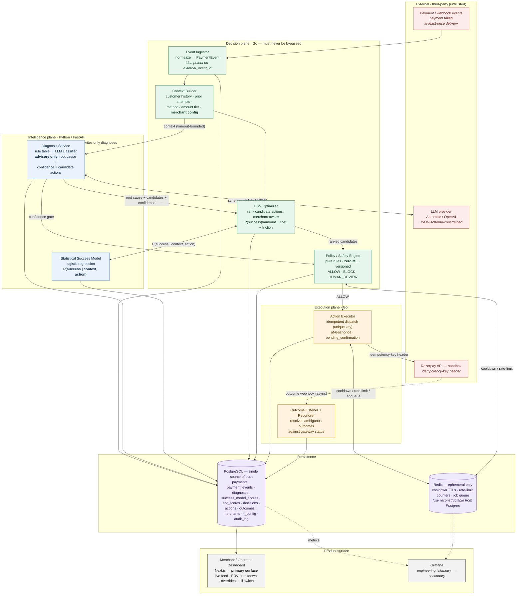
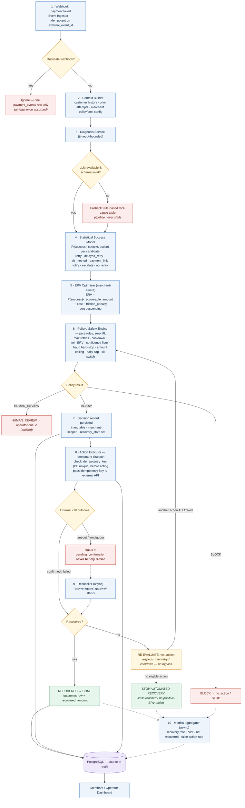
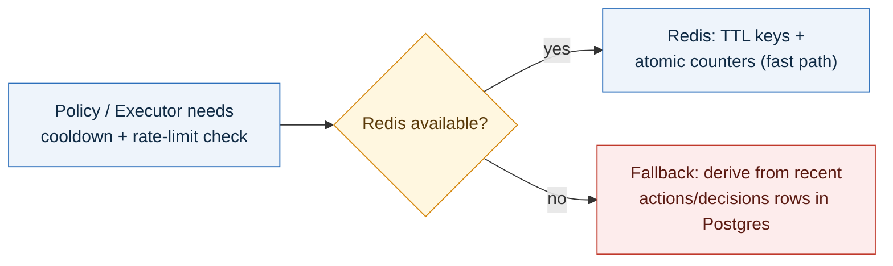
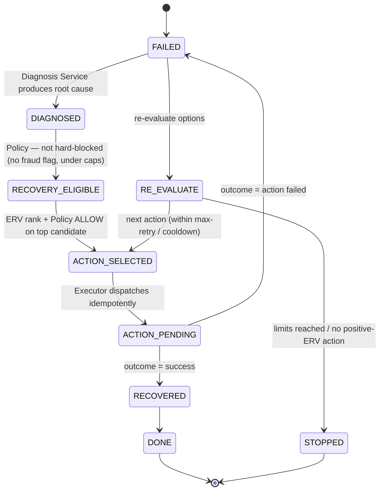
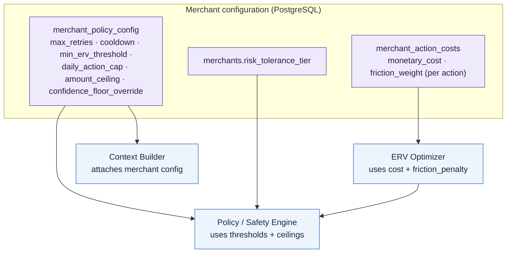

# AI Revenue Recovery Decision Platform — Architecture & Workflow Diagram

> **Final intended system** for Razorpay AI Buildathon Track 03.
> This diagram represents the complete platform as defined in
> [`../PS and Solution/PROBLEM_STATEMENT.md`](../PS%20and%20Solution/PROBLEM_STATEMENT.md) (WHAT/WHY)
> and [`../PS and Solution/PLAN.md`](../PS%20and%20Solution/PLAN.md) (HOW) — not merely the
> currently implemented Phase 1–3 state. Every element traces to those two documents
> (see [Provenance](#provenance)); nothing here is invented.

**The invariant that governs everything below:**

> **The LLM proposes. ML estimates P(success). ERV ranks. Policy constrains. Go executes. PostgreSQL records.**
> No layer skips the one after it. Economics ranks actions; safety constrains actions.

---

## 1. System Architecture (the three planes)

The platform owns the financial decision architecture; an AI-assisted, bounded recovery
agent runs *inside* it. Three cleanly separated planes, one durable source of truth,
one ephemeral coordinator.

**Read it as:** events enter the **Decision plane**, which consults the **Intelligence
plane** for advice (diagnosis) and estimates (`P(success)`), ranks actions by ERV,
then hands the ranked list to the deterministic **Policy/Safety Engine** — the only layer
that can authorize an action. Approved actions go to the **Execution plane**, which acts
idempotently against the payment gateway. **PostgreSQL records everything**; **Redis** only
accelerates coordination and can be lost without affecting correctness.

---

## 2. End-to-End Recovery Workflow (single failed payment)

The runtime decision → recovery loop, with synchronous vs. asynchronous flows and the
failure/fallback branches made explicit.

**Legend:** `──▶` synchronous (in-request) · `╌╌▶` asynchronous (background / webhook / queue) ·
🔶 decision point · 🟥 fallback / safety path.

### Redis-down degradation (correctness never depends on Redis)

---

## 3. Recovery State Machine

Every recovery event carries an explicit, auditable state. This is **not a separate
service** — it is the `decisions.recovery_state` column, transitioned inside the existing
Go decision/execution plane. It prevents uncontrolled retries and makes progress auditable.

> **ACTION_FAILED vs. OUTCOME_UNKNOWN:** an ambiguous external result (timeout after send)
> does **not** move to `FAILED`. The action is marked `pending_confirmation` and reconciled
> against the gateway's idempotent status check before any ledger change — preventing
> accidental duplicate actions.

---

## 4. Merchant-Specific Economics & Multi-Merchant Boundary

Two merchants with an otherwise identical failed payment can rationally choose different
actions, because `cost` and `friction_penalty` take `merchant` as input and policy
thresholds are merchant-overridable (within platform ceilings). Tenancy is a simple
row-level `merchant_id` boundary — no schema-per-tenant, no Kafka, no Kubernetes.

Platform-level safety floors (e.g. the diagnosis **confidence floor**, the **fraud hard-stop**,
and the **kill switch**) are **not** merchant-overridable.

---

## Provenance

Every element above maps to the authoritative documents — nothing is invented.

| Diagram element | Source |
|---|---|
| Three-plane separation, "must never be bypassed" | PLAN §2 |
| Event Ingestor, Context Builder, Diagnosis, Success Model, ERV, Policy, Executor, Reconciler, Audit/Metrics, Dashboard | PLAN §3 (Major Components) |
| Numbered end-to-end data flow (steps 1–10) | PLAN §4 |
| ERV formula `P(success)×amount − cost − friction` | PLAN §5 / PROBLEM_STATEMENT §8 |
| Policy constraints (retries, cooldown, min ERV, confidence floor, fraud hard-stop, amount ceiling, daily cap, kill switch), ALLOW/BLOCK/HUMAN_REVIEW | PLAN §6 |
| Recovery state machine on `decisions.recovery_state` (not a new service) | PLAN §6a / PROBLEM_STATEMENT §10 |
| LLM advisory-only boundaries; statistical model separate from LLM | PLAN §7 / PROBLEM_STATEMENT §9, §23, §24 |
| Data model / stores enumerated in PostgreSQL | PLAN §8 |
| Candidate actions (retry, delayed_retry, alt_method, payment_link, notify, escalate, no_action) | PLAN §4 / PROBLEM_STATEMENT §7 |
| Idempotency key = unique DB constraint; `pending_confirmation`; ACTION_FAILED vs OUTCOME_UNKNOWN | PLAN §8 / PROBLEM_STATEMENT §11, §12 |
| Redis ephemeral, reconstructable from Postgres; Postgres-only vertical slice | PLAN §2, §13 / PROBLEM_STATEMENT §22 |
| Merchant-specific config/economics; row-level tenancy | PLAN §5, §6, §9 / PROBLEM_STATEMENT §14 |
| Dashboard primary, Grafana secondary | PLAN §10, §11 / PROBLEM_STATEMENT §20, §21 |
| At-least-once webhooks; async outcome webhook + reconciliation job; Redis job queue | PLAN §3, §4, §6, §13 |

**Honest limitation (per both documents):** the buildathon `P(success)` model is trained on
synthetic/simulated data; results demonstrate performance in a simulated environment and do
not represent real Razorpay customer behaviour.
